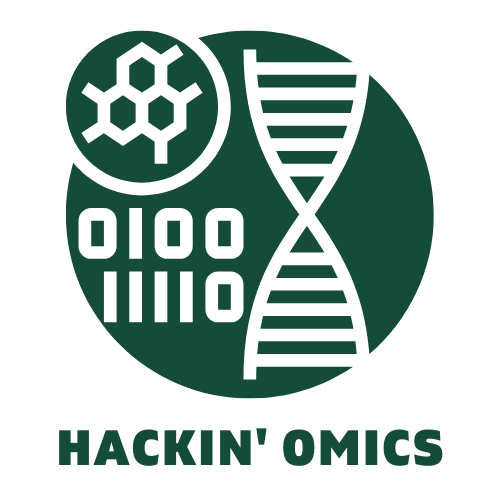

  

# team-leaders-2022

A repository to share resources and a readiness checklist with team leaders for Hackin' Omics 2022.

## Welcome

We'd like to welcome you to Hackin' Omics 2022! We hope you are as excited as we are to have an event focused on building community, increasing technical literacy, and solving scientific problems.

## Readiness Checklist

- [ ] Log in to slack and introduce yourself.
- [ ] Sign up for a GitHub account if you don't have one.
- [ ] Fork this repository.
- [ ] Review the [CODE_OF_CONDUCT](CODE_OF_CONDUCT.md)
- [ ] Review some of the helpful resources we listed in the resources [README](https://github.com/u-brite/team-leaders-2022/blob/main/resources/README.md).
- [ ] Create a GitHub repository for your hackathon team on our **U-BRITE organization** (not on your GitHub profile).
    - [ ] Use the ["team-repo"](https://github.com/u-brite/team-repo-template) template and update with your team's information.
    - [ ] Refine your project proposal based on the feedback given (if there was feedback).
- [ ] Attend workshops to become ready for the hackathon.
    - [ ] Computing Resources Workshop: An Introduction to Jetstream2, HPC, and Git/GitHub | Register at https://tinyurl.com/mubxwc8f | July 27 at 2PM
    - [ ] U-BRITE Bootcamp: Learn how to use PAGER & SEAS for multi-omics downstream analysis by Dr. Jake Chen | Register at https://tinyurl.com/yxx23fph | July 29 at 10AM
- [ ] Ensure any datasets that need to be dowloaded have been mentioned by communicating with Dr. Blake Joyce via slack (His slack is `@Blake Joyce (UAB Research Computing)` or tagging the technical committee on GitHub using `@u-brite/technical-committee`.
  - [ ] Submit this [form](https://airtable.com/shrnpxEogyAzlRWGX) to submit any large dataset that isn't available via an API or is too large to be hosted on a laptop.
- [ ] Complete the above tasks and add your name and project name to the Team Leader Readiness table. Submit a pull request and assign `@u-brite/hackin-omics-co-chairs`.

## Help

If you need help, please view the [discussions tab](https://github.com/u-brite/team-leaders-2022/discussions) on this repository or make an [issue](https://github.com/u-brite/team-leaders-2022/issues/new).

## Team Leader Readiness

| Team Leader | Team Name | Completed Checklist (yes or no) |
|-------------|-----------|---------------------------------|
|Tarun Mamidi |   canAI   |            yes                  |
|Rahul Sharma |MedvAIsor  | Yes                             |
|Arun Boddapati| Team Vecna-scDehasheR|Yes                  |
|             |           |                                 |
|             |           |                                 |
|             |           |                                 |
|             |           |                                 |
|             |           |                                 |
|             |           |                                 |
|             |           |                                 |
|             |           |                                 |
|             |           |                                 |
|             |           |                                 |
|             |           |                                 |
|             |           |                                 |
